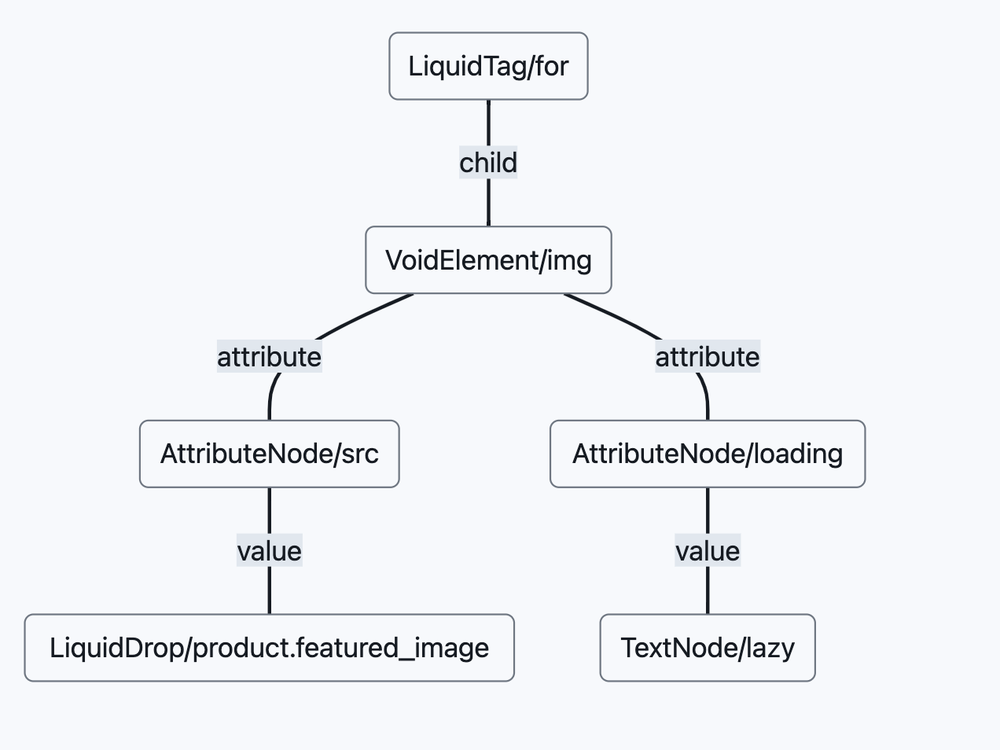
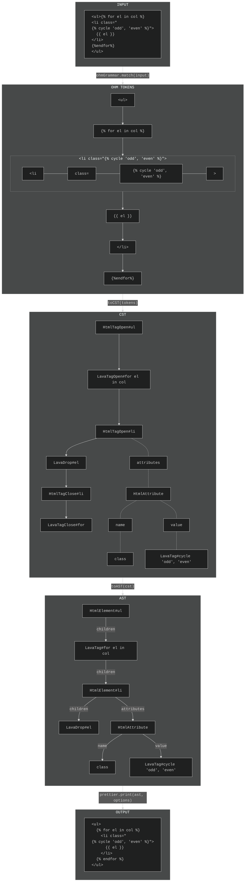

## Intro

Wanted to know how hard it is [to do like the Handlebars folks](https://prettier.io/blog/2021/05/09/2.3.0.html#:~:text=The%20feature%20is,under%20the%20hood.) and make a prettier plugin for Lava.

Our problem: Lava is a _templating_ language. As such, its Abstract Syntax Tree (AST) has no notion of what its text nodes contain.

And since [prettier](https://prettier.io/) is really a `function(ast) -> string`, you can't make pretty Lava + HTML if the AST you have has no notion of HTML.

It's possible though:

https://user-images.githubusercontent.com/4990691/145229362-568ab7d4-4345-42b7-8794-59f7683a88a3.mp4

## How we can handle it

First, we need to make a Lava/HTML parser that supports a stricter form of Lava—One that can form a tree.

This works:

```lava

  

```

Since it can be represented as this tree:



But this doesn't because the div is closed before the if tag was closed:

```lava
<div></div>
```

## How it works

1. We parse the lava source code into an Lava/HTML AST.
   1. Our [harc/ohm](https://github.com/harc/ohm) grammar tokenizes the source code.[(Link to LavaHTML grammar.)](grammar/lava-html.ohm)
   2. From Ohm's tokens, we build a Concrete Syntax Tree (CST). [(Link to Grammar->CST code.)](src/parsers/cst.ts)
   3. From the nodes in the CST, we build an AST. [(Link to CST->AST code.)](src/parsers/ast.ts)
2. From the AST, we build a [`Doc`](https://github.com/prettier/prettier/blob/main/commands.md#prettiers-intermediate-representation-doc) that prettier then prints for us.[(Link to LavaHTML printer)](src/printers/printer-lava-html.ts)

Here's a flowchart that roughly illustrates the process.




